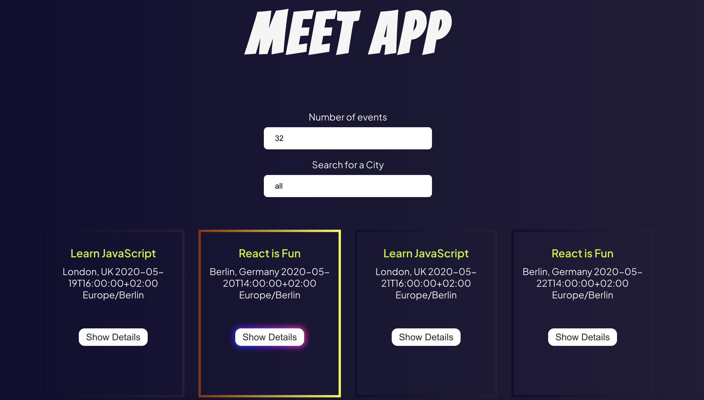

## Meet App

### Introduction

This is a serverless React App built using TDD (Test driven development).App uses Google APi to fetch events data.

### Instructions

This part needs to be updated later on -

### Tech used:

```
HTML
CSS
Javascript
React v18.2.0
AWS Lambda
Serverless
```

---

##### Screenshot of the App:



---

### User stories:

#### Feature: Filter events by city

> ##### Scenario 1: When user hasn’t searched for a city, show upcoming events from all cities.

- Given user hasn’t searched for any city
- When the user opens the app
- Then the user should see a list of all upcoming events

> ##### Scenario 2: User should see a list of suggestions when they search for a city.

- Given the main page is open
- When user starts typing in the city textbox
- Then the user should see a list of cities (suggestions) that match what they’ve typed

> ##### Scenario 3: User can select a city from the suggested list.

- Given the user was typing “Berlin” in the city textbox
- And the list of suggested cities is showing
- When the user selects a city (e.g., “Berlin, Germany”) from the list
- Then their city should be changed to that city (i.e., “Berlin, Germany”)
- And the user should receive a list of upcoming events in that city

#### Feature: Show/Hide Details of an Event

> ##### Scenario 1: An event element is collapsed by default.

- Given: User has opened app
- When: the user views the featured city
- Then: the current events from that city will be collapsed/hidden from the user.

> ##### Scenario 2: User can expand an event to see its details.

- Given: User searched for City,and now has option to see details for an specific event
- When: User clicks on expand button
- Then: User will be able to see all the details for that specific event

> ##### Scenario 3: User can collapse an event to hide its details.

- Given: User expanded event view
- When:User clicks to close the event
- Then: Details will be hidden

##### User Story:

- As a user, I should be able to toggle between expanded and collapsed view, so that I can view all the details from specific event.

#### Feature: Specify Number of Events

> ##### Scenario 1: When user hasn’t specified a number, 32 is the default number.

- Given: User searched for events for a specific City,
- When: User did not specify the number
- Then: default amount of events will be 32.

> ##### Scenario 2: User can change the number of events they want to see.

- Given: User searched for events for a specific City,
- When: User type in the number of events he want to see .
- Then: User will get as much events as he searched for.

##### User Story

- As a user, I should be able to choose to display all events, or just specific number of them, so that I know how what events are taking place.

#### Feature: Use the App when Offline

> ##### Scenario 1: Show cached data when there’s no internet connection.

- Given: App is not connected to internet
- When: Data is cached
- Then: Data will be anyway displayed

> ##### Scenario 2: Show error when user changes the settings (city, time range).

- Given: User opened App settings
- When: User changes some of the settings
- Then: Error will occur

##### User Story

- As a user, I should be able to use my app offline, so that I can use my app without internet

#### Feature: Data Visualisation

> #### Scenario 1: Show a chart with the number of upcoming events in each city.

- Given: User searched for a City
- When: User selected chart form to display events
- Then: Chart will be displayed, showing upcoming events.

#### User Story

- As a user, I should be able to display upcoming events in chart form, so that I can navigate through easier.

---

### Links:

[Github pages](https://navi5599.github.io/meet/)
