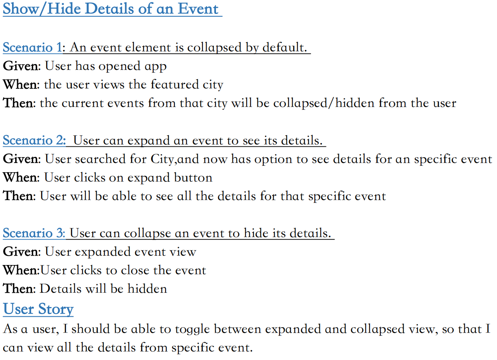
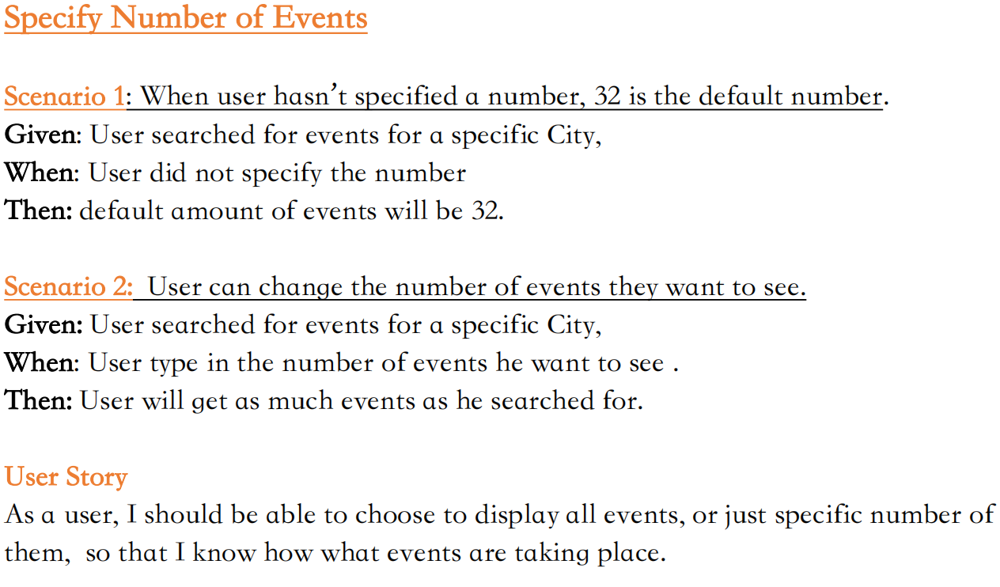
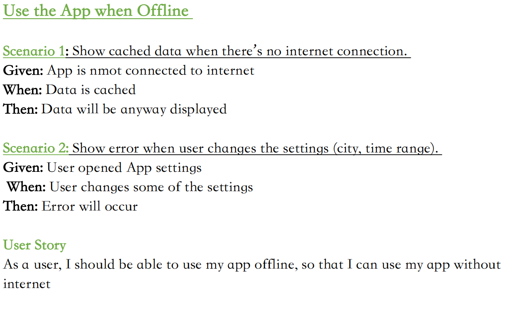
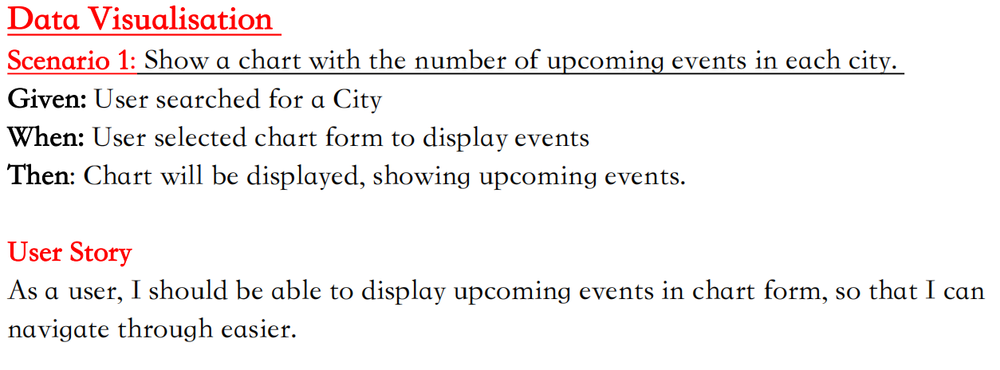

## Meet App

### Introduction

## This is a serverless React App built using TDD (Test driven development).App uses Google APi to fetch events data.

### Instructions

This part needs to be updated later on -

### Tech used:

```
HTML
CSS
Javascript
React v18.2.0
AWS Lambda
Serverless
```

---

### User stories:

 
 
 
 

---

### Links:

[Github pages](https://navi5599.github.io/meet/)
